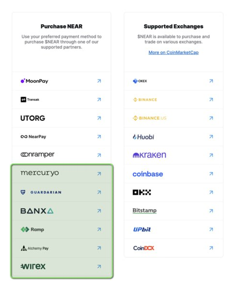

# 📐 Onramps


Onramps that NEAR Supports. It is important to note based on different geographical restrictions, their are different KYC requirements.&#x20;


| Name        | Fees | Jurisdiction | Notes             |
| ----------- | ---- | ------------ | ----------------- |
| Onramper    |      |              | onramp aggregator |
| Meld        |      |              |                   |
| Transak     |      |              |                   |
| Utorg       |      |              |                   |
| Moonpay     |      |              |                   |
| NEARPay     |      |              |                   |
| BANXA       |      |              |                   |
| Ramp        |      |              |                   |
| Alchemy Pay |      |              |                   |
| Wirex       |      |              |                   |
| Coinflow    |      |              |                   |
| Noramp      |      |              |                   |
| Guardarian  |      |              |                   |
|             |      |              |                   |

<figure><figcaption>
Onramps and Exchanges that support NEAR native
</figcaption></figure>
